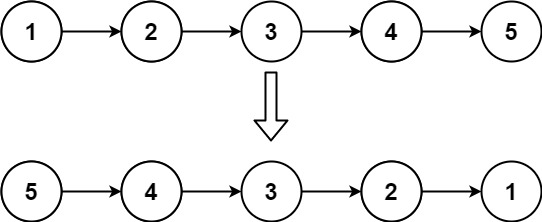
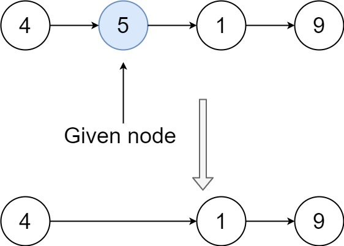

### Task 1. Leetcode: 206. Reverse Linked List

Given the head of a singly linked list, reverse the list, and return the reversed list.



**Constraints**
- The number of nodes in the list is the range [0, 5000].
- -5000 <= Node.val <= 5000

### Task 2. Leetcode: 21. Merge Two Sorted Lists

- You are given the heads of two sorted linked lists list1 and list2.  
- Merge the two lists in a one sorted list. The list should be made by splicing together the nodes of the first two lists.
- Return the head of the merged linked list.

**Constraints**

- The number of nodes in both lists is in the range [0, 50].
- -100 <= Node.val <= 100
- Both list1 and list2 are sorted in non-decreasing order.


### Task 3. Leetcode: 237. Delete Node in a Linked List

There is a singly-linked list head, and we want to delete a node in it.

You are given the node to be deleted node. You will not be given access to the first node of head.

All the values of the linked list are unique, and it is guaranteed that the given node node is not the last node in the linked list.

Delete the given node. Note that by deleting the node, we do not mean removing it from memory. We mean:

- The value of the given node should not exist in the linked list.
- The number of nodes in the linked list should decrease by one.
- All the values before node should be in the same order.
- All the values after node should be in the same order.



### Task 4. Leetcode: 341 Flatten Nested List Iterator


You are given a nested list of integers nestedList. Each element is either an integer or a list whose elements may also be integers or other lists. Implement an iterator to flatten it.

Implement the NestedIterator class:

```NestedIterator(List<NestedInteger> nestedList)``` Initializes the iterator with the nested list nestedList.  
```int next()``` Returns the next integer in the nested list.  
```boolean hasNext()``` Returns true if there are still some integers in the nested list and false otherwise.  

Your code will be tested with the following pseudocode:
``` 
initialize iterator with nestedList
res = []
while iterator.hasNext()
append iterator.next() to the end of res
return res
```
If res matches the expected flattened list, then your code will be judged as correct.