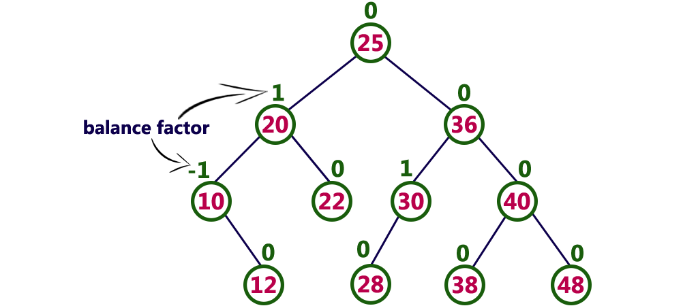
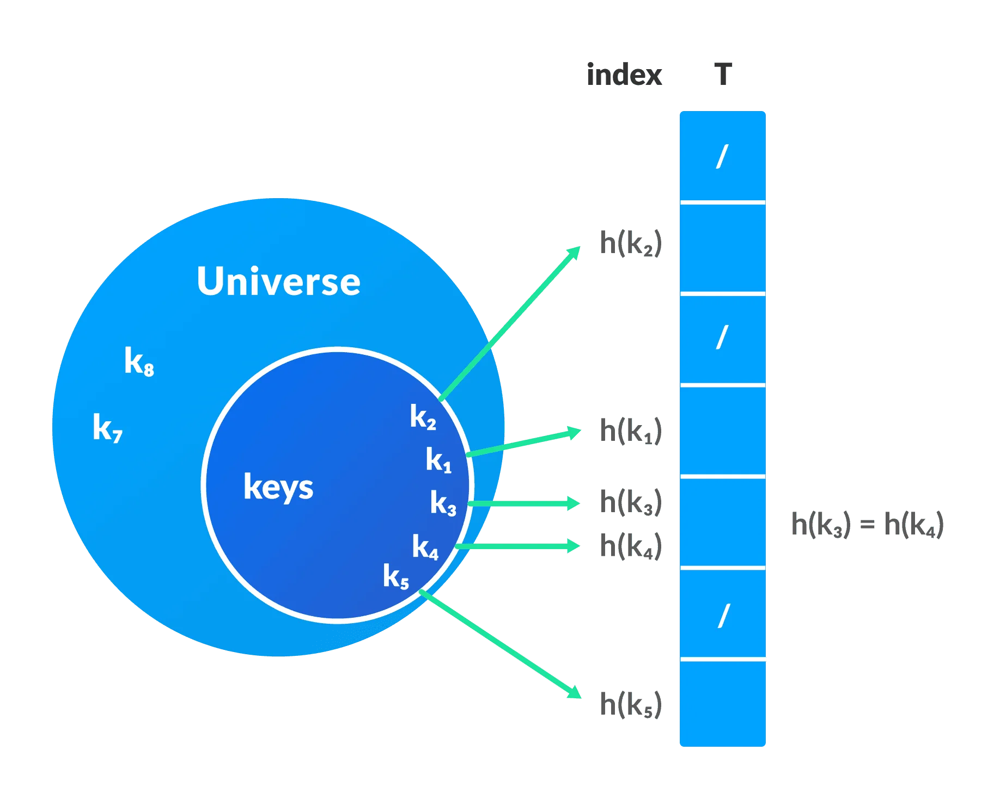

# Table of content

[Algorithms](#algorithms)
1. [Complexity](#algorithms-complexity)
2. [Numerical](#numerical-algorithms)

[Data structures](#data-structures)  
1. [Linear. Stack](#stack)
2. [Linear. Queue](#queue)
3. [Linear. LinkedList](#linkedlist)
4. [Tree. General](#tree)
5. [Tree. BTS](#binary-search-tree--bst-)
6. [Tree. AVL](#avl-tree)
7. [Other. HashTable](#hash-table)


# Links

- [Programiz course](https://www.programiz.com/dsa/algorithm)
- [Data structures in BSC](http://www.btechsmartclass.com/data_structures/introduction-to-algorithms.html)
- [Algorithms and data structures in JS](https://github.com/trekhleb/javascript-algorithms)
- Data structures in Habr: 
  - [Article 1](https://habr.com/ru/companies/netologyru/articles/334914/)
  - [Article 2](https://habr.com/ru/articles/128457/)

# Algorithms 

In computer programming terms, an algorithm is a set of well-defined instructions to solve a particular problem. It takes a set of input(s) and produces the desired output.

- input and output should be defined precisely, 
- each step in the algorithm should be clear and unambiguous, 
- algorithms should be most effective among many ways to solve a problem.
- algorithm should be generic (for usage with any programming language)

## Algorithms complexity

**Asymptotic analysis** is measure of how performance has changed with the change of the input size. 

**Why?**
- Compare algorithms
- Predict behavior
- Provability

**Key thing** - consuming resources (time, RAM | Disk space, network, CPU, hardware etc)  

**Cases**: best, average, worst, excepted, every.

**Measures** 
- Big O notation - the worse case
- Omega notation - the best case
- Theta notation - the average case

### Big O
  - f(n) steps = O(f(N))
  - g(N) steps followed by f(N) steps ⇒ O(g(N) + f(N))
  - g(N) steps followed by f(N) steps, if f(N) > g(N) ⇒ O(f(N))
  - g(N) for each f(N) ⇒ O(g(N) * f(N))
  - O(C*f(N)) = O(f(N))


### Masters theorem
For estimation of recurrence relations.


### Divide and Conquer Algorithms

1. *Divide*: Divide the given problem into sub-problems (using recursion).
2. *Conquer*: Solve the smaller sub-problems recursively. If the subproblem is small enough, then solve it directly.
3. *Combine*: Combine the solutions of the sub-problems.

Complexity according to the [Masters theorem](#Masters-theorem): **O(n log n)**

*Pros*:
- usually  memory-safe,
- suitable for multithreaded programs

Don't store the result of any sub-problem for future referencing (in difference with dynamic algorithms). 

[Examples - sorting algorithms](#sorting-algorithms)

### Greedy algorithms

**Greedy approach** means that we try to find the optimal solution on each step of the solution not revising it later. 
However, the final solution may not be optimal.

*Pre-conditions* to use the greedy approach: 
- optional solution can be found by finding optimal solutions of each sub-problem it has (*optimal sub-structure*)
- problem can be solved by finding an optimal solution on each step of it without reconsidering it (*greedy choice property*).

*Pros*
- easy to understand
- better performance in many cases
*Cons* 
- optimal solution of the whole problem may not be found

### P vs NP

P - algorithms with deterministic number of steps, []
NP - algorithms without deterministic number of steps where you need to make assumptions but the solution if found can be checked for a deterministic time.

## Numerical algorithms 

### Random numbers
- PRNG - *pseudorandom number generators* (having know the algorithms & (initial stage | sequence of numbers), the next numbers can be predicted)
- CRNG - *cryptographic random number generators* (hard to predict the sequence of numbers)
- TRNG - *true random number generators* (use random fluctuations to generate numbers, very slow)

### Linear Congruential generators
Generator of a linear sequence of numbers.   
`X<sub>(n+1)</sub> = X<sub>n</sub> * A + B (mod M)`

### Randomizing arrays
Basically, swapping two elements randomly. 
Probabilities: 
- not being picked by (k-1): `(N-(k-1))/N`
- being picked for position k: `1/N`  
Usage
- randomize an array
- pick random values without duplication
- pick N of M

### GDC & LCM

**GCD** - greatest common division (the greatest number on which both A and B can be divided). Use *Euclid's algorithm* (complexity = O(log(n))).  
**LCM** - least common multiple (the lowest number that can be divided on A and B)
```bash
LCM = (A,B) / GDC(A,B)
# trick: divide A on GDC
LCM = (A / GDC(A,B)) * B 
```

### Primes

**Prime factorization** is a process of splitting a number into prime multipliers. Algorithm = check all numbers from 2 to a square root of the input. 

## Sorting algorithms 

|      Name      |    Best     |    Worst    |   Average   |   Space   | Stability* | Use-cases                                                          | Description                                                                                                                                        |
|:--------------:|:-----------:|:-----------:|:-----------:|:---------:|:----------:|:-------------------------------------------------------------------|:---------------------------------------------------------------------------------------------------------------------------------------------------|
|  Bubble sort   |    O(N)     |    O(N2)    |    O(N2)    |   O(1)    |    Yes     | learning, small inputs                                             | Iterating for each element over all rest elements and swapping adjacent ones                                                                       |
| Selection sort |    O(N2)    |    O(N2)    |    O(N2)    |   O(1)    |     No     | learning, small inputs                                             | Compare each element with others and swap it with the one that is lower than the current                                                           |
| Insertion sort |    O(N)     |    O(N2)    |    O(N2)    |   O(1)    |    Yes     | small inputs or partly sorted data sets                            | Iterate over the array and insert the element into the sorted part on the proper place.                                                            |
|   Merge sort   | O(N*log(N)) | O(N*log(N)) | O(N*log(N)) |   O(n)    |    Yes     | large data sets                                                    | Divide & conquer: split the original array into pieces, sort pieces and combine sorted arrays into the result                                      |
|   Quick sort   | O(N*log(N)) | O(N*log(N)) | O(N*log(N)) | O(log(N)) |     No     | large data sets                                                    | Divide & conquer: separate elements relatively to the chosen pivot element (< >) and then split the sequence into two pieces by this pivot element |   
| Counting sort  |  O(N+MAX)   |  O(N+MAX)   |  O(N+MAX)   |  O(MAX)   |    Yes     | small range of values                                              | Calculate occurrences of elements cumulatively (in an array) and derive the final index of the element from this auxiliary array                   |
|   Radix sort   |  O(N+MAX)   |  O(N+MAX)   |  O(N+MAX)   |  O(MAX)   |    Yes     | data sets of integers or strings with fixed lengths                | Sorting using any stable sorting algorithm by all digits in numbers of the original array.                                                         |
|  Bucket sort   |  O(N+MAX)   |    O(N2)    |    O(N)     | O(N+MAX)  |    Yes     | uniformly distributed values over a range                          | Scatter-gather approach: split elements into several buckets -> sort them using any stable sorting algorithm -> combine them into the result one   |
|   Heap sort    | O(N*log(N)) | O(N*log(N)) | O(N*log(N)) |   O(1)    |     No     | k larges or smallest elements, when memory usage is concern        | Convert an array to a heap (heapify)                                                                                                               |
|   Shell sort   | O(N*log(N)) |    O(N2)    | O(N*log(N)) |   O(1)    |     No     | medium-sized datasets where insertion sort is not efficient enough | Iterating and comparing elements of the array based on the pre-defined sequence                                                                    |

<sup>*</sup> A *stable* sorting algorithm maintains the relative order of the items with equal sort keys

1) **Bubble sort** - Iterating for each element over all rest elements and swapping adjacent ones.    
2) **Selection sort** - Compare each element with others and swap it with the one that is lower than the current.
3) **Insertion sort** - Iterate over the array and insert the element into the sorted part on the proper place.  
4) **Merge sort** - Divide & conquer: split the original array into pieces, sort pieces and combine sorted arrays into the result.
5) **Quick sort** - Divide & conquer: separate elements relatively to the chosen pivot element (< | >) and then split the sequence into two pieces by this pivot element.
6) **Counting sort** - Calculate occurrences of elements cumulatively (in an array) and derive the final index of the element from this auxiliary array.
7) **Radix sort** - Sorting using any stable sorting algorithm by all digits in numbers of the original array.
8) **Bucket sort** - Scatter-gather approach: split elements into several buckets -> sort them using any stable sorting algorithm -> combine them into the result one.
9) **Heap sort** - Convert an array to a heap (heapify).
10) **Shell sort** - iterating and comparing elements of the array based on the pre-defined sequence:
```
    - Shell's original sequence: N/2 , N/4 , …, 1  
    - Knuth's increments: 1, 4, 13, …, (3k – 1) / 2  
    - Sedgewick's increments: 1, 8, 23, 77, 281, 1073, 4193, 16577...4j+1+ 3·2j+ 1  
    - Hibbard's increments: 1, 3, 7, 15, 31, 63, 127, 255, 511…  
    - Papernov & Stasevich increment: 1, 3, 5, 9, 17, 33, 65,...  
    - Pratt: 1, 2, 3, 4, 6, 9, 8, 12, 18, 27, 16, 24, 36, 54, 81...   
``` 

## Search algorithms 

|      Name      | Best |  Worst   | Average  |   Space   |
|:--------------:|:----:|:--------:|:--------:|:---------:|
| Linear search  |  -   |    -     |   O(N)   |   O(1)    |
| Binary search  | O(1) | O(log N) | O(log N) |   O(1)    | 

1. **Linear search** - very straightforward, go through the elements and compare each one with the target
2. **Binary search** - only under sorted array, iterative and recursive approach, compare the target with the middle element and then choose the right half of the array to continue comparing


## Graph algorithms

The purpose of the algorithms is to mark each vertex as visited while avoiding cycles.

### DSA (Depth-first search algorithms)

1. Pre-conditions: we have a stack and a visited list
2. Take any vertex and put into the stack
3. Take the top element from the stack and put it into visited list
4. Take all adjacent vertices of the chosen element and put unvisited into the stack
5. Repeat steps 3-4 withe vertices in the stack until it's empty. 

|  Time  | Search |
|:------:|:------:|
| O(V+E) |  O(V)  | 

### BSA (Breadth-fist search algorithm)

1. Pre-conditions: we have a queue and a visited list
2. Take any vertex and put into the queue
3. Take the first element from the queue and put it into visited list
4. Take all adjacent vertices of the chosen element and put unvisited into the queue
5. Repeat steps 3-4 withe vertices in the stack until it's empty.

|  Time  | Search |
|:------:|:------:|
| O(V+E) |  O(V)  | 


### Bellman Ford's Algorithm

It helps us find the shortest path from a vertex to all other vertices of a weighted graph with possible negative weights of edges.

|         |  Time  | Search |
|:-------:|:------:|:------:|
|  Best   |  O(E)  |  O(V)  |
| Average | O(V*E) |        | 
|  Worst  | O(V*E) |        | 

## Greedy algorithms 

### Ford-Fulkerson Algorithm

Calculating the maximum possible flow in a network or a graph.

**Use-cases**
- network flow optimization: e.g. in transportation systems to find the maximum flow of goods from a source to a destination,
- capacity planning: e.g. the capacity of data channels needs to be optimized to handle the maximum possible traffic,
- image processing (image segmentation),
- resource allocation: e.g. assigning tasks to workers, scheduling jobs, etc. 

**Example**
- we can send 2 items though the top path (limited by the last step)
- we can send 3 items though the top path (limited by the first step)
- we can send 2 items though the top path (2/4 in the first 2 nodes) 
-> send them through the path with 0/3 
- ->  send them through the last 2 nodes of the bottom path (3/6 in the last 2 nodes)  

Overall score = 2 + 3 + 2 = 7


**Time complexity** = O(E * |f|), where E - number of edges, f - maximum flow number

### Dijkstra's Algorithm

Graph traversal algorithm that finds the shortest path from a source vertex to all other vertices in a weighted graph.

The main idea is the process of iteratively selecting the vertex with the smallest distance and updating distances to its neighboring vertices. 

**Flow** 

1) Create a set of unvisited vertices and set the distance from the source vertex to all other vertices as infinity, except the source vertex itself, which is set to 0.
2) Set the source vertex as the current vertex.
3) While there are unvisited vertices:
   - Select the unvisited vertex with the smallest distance as the current vertex. 
   - Mark the current vertex as visited. 
   For each neighboring vertex of the current vertex:
     - Calculate the distance from the source vertex to the neighboring vertex by adding the weight of the edge between them to the distance of the current vertex.
     - If this calculated distance is smaller than the recorded distance of the neighboring vertex, update the recorded distance with the new value.
4) Once all vertices have been visited or the destination vertex (if specified) has been visited, the shortest path from the source vertex to each vertex can be determined.

**Use-cases**
- routing in computer networks
- GPS navigation systems 
- transportation and logistics
- airline flight scheduling

**Time complexity** = O(E Log V), E - number of edges, V - number of vertices. 

## Kruskal's Algorithm

Kruskal's algorithm is a minimum spanning tree algorithm (spanning tree with minimum sum of weights of edges). 

**Use-cases**
- network design, 
- construction of roads and pipelines,
- cluster analysis: where the goal is to group similar data points together

**Flow**
1. Sort all the edges from low weight to high
2. Take the edge with the lowest weight and add it to the spanning tree. 
If adding the edge created a cycle, then reject this edge.
3. Keep adding edges until we reach all vertices.

**Time complexity** = O(E log E), E - number of edges. 

## Prim's Algorithm

Prim's algorithm is a minimum spanning tree algorithm (spanning tree with minimum sum of weights of edges).

**Use-cases**
- network design,
- construction of roads and pipelines,
- cluster analysis: where the goal is to group similar data points together

**Flow**
1. Initialize the minimum spanning tree with a vertex chosen at random.
2. Find all the edges that connect the tree to new vertices, find the minimum and add it to the tree
3. Keep repeating step 2 until we get a minimum spanning tree

**Time complexity** = O(E log V), V - number of vertices. 

## Huffman Coding

Huffman Coding is a technique of compressing data to reduce its size without losing any of the details, generally useful to compress the data in which there are frequently occurring characters.

**Use-cases**

**Flow**

1. Calculate the frequency of each character in the string.
2. Sort the characters in increasing order of the frequency.

3. Make each unique character as a leaf node. 
4. Form a tree according to the rules.


**Time complexity** = O(nlog n);

## Dynamic programming 


# Data structures

Data structure is a storage that is used to store and organize data. It is a way of arranging data on a computer so that it can be accessed and updated efficiently.

- **linear** (array, linked list, stack, queue)
  - complexity increase proportionally to data set size
  - pretty simple, but less efficient in memory consumption
  - can be traversed by one pass
- **non-linear** (graph, tree):
  - keep the same level of complexity with increasing amount of data
  - more complex, but more efficient in memory consumption,
  - can't be traversed by one pass

## Linear

### Stack


*LIFO* - last-in, first-out

Operations:
  - push - add an element to the top
  - pop - remove an element from the top
  - peek - get an element from the top without removing
  - isEmpty
  - isFull

| Space | Search | Insertion | Deletion | 
|:-----:|:------:|:---------:|:--------:|
| O(n)  | 	O(n)  |   O(1)    |   O(1)   | 


### Queue


*FIFO* - first in, first out

Operations
  - enqueue (offer) - add an element to the bottom, **O(1)**
  - dequeue (poll) - withdraw an element from the top, **O(1)**
  - peek - get an element from the top **O(1)**
  - isEmpty
  - isFull

Types:
  - *circular queue* - better memory utilization: when the rear index reach the end of the array, we can use free slots in the beginning
  - *priority queue* - all elements have their priority and are processed regarding this priority (implementation based on LinkedList, BinaryHeap, or BinaryTree)
  - *dequeue* - insertion and removal can be performed from both sides. 

| Space | Search | Insertion | Deletion | 
|:-----:|:------:|:---------:|:--------:|
| O(n)  | 	O(n)  |   O(1)    |   O(1)   | 


### LinkedList

Linear data structure that includes a series of connected nodes, where each node stores the data and the address of the next node.


**Types**
- singly - each node points to the next one
- doubly - two pointers in each node: to the previous and the consequent elements
- circular - last elements has a reference to the first one

**Operations**
- traverse - go through all nodes of the list
- insert
- delete
- search - find a node
- sort

| Space | Search/Traverse | Insertion | Deletion |
|:-----:|:---------------:|:---------:|:--------:|
| O(n)  |      O(n)       |   O(1)    |   O(1)   | 


## Tree

Data structure consisting of *nodes* (key | value + a pointer to the next node) and *edges* (links between nodes). 

**Terminology**:
- *root* - the top node, 
- *leaf* - node without a pointer to the next node,
- *internal node* - node with a pointer to the next node,
- *height of the node* - number of edges *from a node to the deepest leaf* (bottom)
- *depth of the node* - number of edges *from a node to the root* (up)
- *height of the tree* - number of edges *from the root to the deepest leaf*
- *degree of node* - number of branches the node have
- *forest* - several disjoint trees. 

**Tree traversal**

- *inorder* - left branch/left leaf -> root -> right branch/right leaf: 5 -> 12 -> 6 -> 1 -> 9
```java
public void traverse(Node node){
    if(node!=null){
        traverse(node.left);
        System.out.print(" "+node.key);
        traverse(node.right);
    }
}
```
- *preorder* - root -> left branch -> right branch: 1 -> 12 -> 5 -> 6 -> 9
```java
public void traverse(Node node) {
    if (node != null) {
        System.out.print(" " + node.key);
        traverse(node.left);
        traverse(node.right);
    }
}
```
- *postorder* - left branch/left leaf -> right branch/right leaf -> root: 5 -> 6 -> 12 -> 9 -> 1
```java
public void traverse(Node node) {
    if (node != null) {
        traverse(node.left);
        traverse(node.right);
        System.out.print(" " + node.key);
    }
}
```

### Binary tree

Tree data structure where each node can have two children at most. 
Node = value + link to the right node + link to the left node.

**Types**
- *full* - each node has 2 or 0 children.
- *perfect* - each node has 2 children + leaves are on the same level
- *complete* - like a full, but: leaves lean to the left + the right branch might not have a right leaf
  
- *degenerate (pathological)* - each node has only right or left child
  
- *skewed* - type of the pathological tree, all nodes go to the left or right
- *balanced* - difference between height of the right and left subtrees is 0 | 1  

  |Balances tree            |         Unbalanced tree         |   
  |:-------------------------------:|:-------------------------:|  
  |||

**Height <-> Number of nodes**

- *Minimum number of nodes* = height + 1
- *Maximum number of nodes* = 2<sup>(height+1)</sup>-1
- *Minimum number of nodes* = floor (log2n)                                                                                              
- *Maximum number of nodes* = number of nodes - 1

### Binary search tree (BST)

Binary tree structure where: 
- all nodes to the left of the root is less than the root
- all nodes to the right of the root is bigger than the root.
- each and every subtree is BST too.

Operations:
- insertion
- deletion (of a leaf, of an internal node with one or two sub-nodes)

|   Search    | Insertion  |  Deletion  | Space |
|:-----------:|:----------:|:----------:|:-----:|
| 	O(log(n))* | O(log(n))* | O(log(n))* | O(n)  |

<sup>*</sup> Search, Insertion and deletion operations can be O(n) when all nodes have only one sub-node. 


### AVL tree

AVL tree is a self-balancing binary search tree in which each node maintains extra information called a balance factor whose value is either -1, 0 or +1.

**Balance factor** = height of the left subtree - height of the right subtree. 

**Operations** 
- insertion
- deletion
- search
- rotation

When we *insert* or *delete* something we need to balance tree by performing rotation operation. 

**Rotations**
- single left rotation - every node move one position left
- single right rotation - every node move one position right
- left right rotation - single left -> single right
- right left rotation - single right -> single left

|   Search    | Insertion  |  Deletion  | Space |
|:-----------:|:----------:|:----------:|:-----:|
| 	O(log(n))* | O(log(n))* | O(log(n))* | O(n)  |

<sup>*</sup> Because of self-balancing nature, complexity is always the same. 



### B-Tree

B-Tree is a self-balanced tree in which every node can have more than one key and more than 2 children.  
Number of keys and children defines by the *order* of a B-tree. 

*Reason behind this structure* - save time reading and writing to a hard drive. 

**Rules** of B-tree:
- keys and children depending on *order n*: keys in [n/2-1; n-1], children in [n/2; n] 
- all leaves are at the same level
- root node must have at least 2 children
- all keys in nodes sorted in ASC

**Operations**
- search
- insertion (find the appropriate node + insertion + splitting the node if needed)
- deletion (find the appropriate node + deletion + balancing the tree)

|   Search   | Insertion | Deletion  | Space |
|:----------:|:---------:|:---------:|:-----:|
| 	O(log(n)) | O(log(n)) | O(log(n)) | O(n)  |


### B+-Tree

Tree structure implementing multi-level indexing which means that only leaf nodes has values. 

|            B-Tree             |            B+-Tree             |   
|:-----------------------------:|:------------------------------:|  
|  |  |

**Rules**
- all leaf nodes at the same level
- only leaf nodes contains values
- leaf nodes have links
- children: root has at least 2 children, other nodes [n/2, n] (n - order of a tree)
- keys in [n/2-1; n-1]

**Operations**
- search
- insertion (find the appropriate node + insertion + balancing/splitting the node if needed)
- deletion (find the appropriate node + deletion + balancing the tree)


### Red-Black Tree

Red Black Tree is a Binary Search Tree in which re-balancing mechanism is based on the color of the node (RED or BLACK).

*Node* = key + color + left node link + right node link + parent link (except of the root)

Rules:
- each node has a color
- the root is black
- leaf nodes are black
- children of a red node are black
- every path (root to leaf) have to have the same number of black nodes
- every new node is red (insertion -> to not violate the rule of the depth in black nodes)

**Operations**
- search
- insertion (find the appropriate node + insertion + balancing/splitting the node if needed)
- deletion (find the appropriate node + deletion + balancing the tree)
- recoloring/rotation (internal operations for balancing a tree after inserting or deleting a node)


### Heap

Complete *binary tree* that satisfy to one of the *heap properties*:
- *max heap property* - a node is always greater than its children and the root is maximum
- *min heap property* - a node is always smaller than its children and the root is minimum


Operations:
- heapify - create a heap from a linear structure | restructure it
- insert - add an element (node) and heapify
- delete - delete an element and heapify
- peek (max/min) - get the root
- extract (max/min) - poll the root and heapify 

| Peek | Search | Insertion | Deletion  | Space |
|:----:|:------:|:---------:|:---------:|:-----:|
| O(1) | 	O(n)  | O(log(n)) | O(log(n)) | O(n)  |


## Graph

Data structure consisting of nodes (vertices) and edges connecting these nodes.


V (vertices) = {0, 1, 2, 3}  
E (edges) = {(0,1), (0,2), (0,3), (1,2)}  
- directed
- undirected
- weighted  

**G = {V, E}**

**Terminology**  
*Adjacency* - a situation when vertices are connected with an edge.  
*Path* - a sequence of edges between two vertices.
*Endpoints* - two vertices connected by an edge
*Origin* | *Destinations* - in a directed graph: initial point and all other points.  
*Outgoing* | *Incoming* - in a directed graph: an edge from and edge to a vertex respectively. 
*Degree* | *Indegree* | *Outdegree* - number of edges connected to a vertex (incoming | outgoing for directed graphs)
*Self-loop* - two endpoint of a edge coincide with each other 

**Types**
- directed - edge represent one-way connection between nodes
- undirected - edge represent bidirectional connection between nodes
- mixed - there directed and undirected edges in a graph

**Spanning tree**  
  Sub-graph of *undirected* graph which includes all vertices with a minimum possible number of edges.  
  Total number of options for the graph with n vertices = **n<sup>n-2</sup>**  
  Minimum spanning tree must minimize the weight of edges (if they are weighted).

**Strongly connected components (SCC)**
Applicable only for directed graph. Cluster of vertices where there is a path from each vertex to another one.  
Use *Kosaraju's Algorithm* (Косараджу) to find all cluster of SCC.


| Space  | Add V | Add E | Remove V | Remove E |
|:------:|:-----:|:-----:|:--------:|:--------:|
| O(V+E) | O(1)  | O(1)  |  O(V+E)  |   O(E)   |

### Graph representation

1. *Adjacency matrix* - 2D matrix with vertices as indexes (size: V*V) and values of it indicate the path between vertices (true | false, 1 | 0)  
Symmetric for an undirected graph

|                              Pros                               |                          Contras                           | 
|:---------------------------------------------------------------:|:----------------------------------------------------------:|
| basic operations is very fast (add/remove the edge, check edge) | memory consuming (usually graph don't have som many edges) |
|                     allow matrix operations                     |                                                            |


2. Incidence Matrix - 2D matrix, size V*E, filled with -1, 0 and 1, representing ingoing, outgoing and absence of connection between vertices. 


3. *Adjacency linked list* - all connections of one vertex in form of nodes of a LL.

|                       Pros                       |                                   Contras                                    | 
|:------------------------------------------------:|:----------------------------------------------------------------------------:|
| memory consumption (only values for real edges)  | difficult to find a list of all adjacent vertices (iterating through all LL) |
| ease in finding vertices adjacent to the current |                                                                              |


## Other

## Hash Table

Data structure that store elements in key-value pairs: *key* - indexes of values, *values* - associated data stored in e.g. array. 



*Hash function* is used to calculate a key. 
The key feature of the hash function is the ability to avoid *collisions* (situations when the hash function generate the same keys for different values).

**Collision resolving**
- chaining (LinkedList connected to a index)
- open addressing (calculating a new index)
  - linear probing - set the value in adjacent slots 
  - quadratic probing - slots increase quadratic (not linear)
  - double hashing - calculate hash one more time

**Good hashing functions**
- division - ```k mod m``` (k - key, m - size of a table)
- multiplication
- universal - index is chosen independent from keys. 

| Space | Search* | Insertion* | Deletion* |
|:-----:|:-------:|:----------:|:---------:|
| O(n)  |  O(1)   |    O(1)    |   O(1)    | 

<sup>*</sup> Search, Insertion and deletion operations can be O(n) when:
- using bad hashing function (all pair are in the same index slot). 
- hash table is full and we need to re-structure it. 